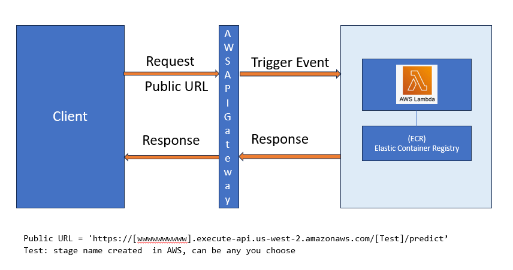

# Zoomcamp ML project

## Website phishing and scam prediction


## 1. Description of the problem
<p>
Website phishing is a form of cyberattack where malicious actors create a fraudulent website that mimics a legitimate one. The goal is to deceive users into revealing sensitive information, such as:  
Login credentials,Credit card details, Personal identification data (e.g., Social Security numbers), Account details for financial systems  

These fake websites often closely resemble the appearance and URL of a trusted site, making it difficult for users to distinguish between the legitimate and malicious versions.  

Techniques Used in Website Phishing  
Spoofed URLs: Cybercriminals use URLs similar to legitimate websites (e.g., using "g00gle.com" instead of "google.com").  
Email Phishing: Victims are lured through emails containing links to the phishing site.  
Clone Websites: Replicas of legitimate websites with subtle differences.  
SSL Certificates: Phishing sites might also use HTTPS to appear more authentic.  
Pop-up Forms:Fake login or payment forms embedded in legitimate-looking sites.  

How Website Phishing Affects Online Trading  
Online trading platforms, such as stock brokerages, cryptocurrency exchanges, and e-commerce websites, are frequent targets of phishing attacks.  
The impact includes:  
1. Loss of Sensitive Information  
2. Theft of Funds  
3. Compromised Reputation  
4. Fraudulent Trades and Market Manipulation  
5. Identity Theft  
6. Loss of Business Opportunities  
  

The goal is to use set collected features to predict phishing websites and avoid/minize losses.  
</p>

## 2. Create environment
```
conda create --name ml-zoomcamp python=3.11.10
conda activate ml-zoomcamp

pip install -q scipy
pip install pandas
pip install numpy
pip install seaborn
pip install scikit-learn
pip install waitress
pip install pipenv


```

## 3. Data
<p>
Data is download from the URL https://archive.ics.uci.edu/dataset/327/phishing+websites

<p>

## 3.1 Data Features

All data fields are described in [Phishing_Websites_Features](data\Phishing_Websites_Features.pdf)  


<p>
All features are encoded as follows:  

| **Category**   | **Value** |
|----------------|-----------|
| Legitimate     | 1         |
| Suspicious     | 0         |
| Phishing       | -1        |

The results column is encoded as :  
| **Category**   | **Value** |
|----------------|-----------|
| Legitimate     | 1         |
| Phishing       | -1        |

</p>

<p>

| **Feature**                       | **Description** |
|-----------------------------------|-------------|
| Having IP Address                 | Checks if the URL contains an IP address instead of a domain name. |
| URL Length                        | Measures the length of the URL. |
| Shortening Service                | Checks if the URL uses a URL shortening service (e.g., bit.ly, tinyurl). |
| Having '@' Symbol                 | Determines if the URL contains the '@' symbol, which can be used to trick users. |
| Double Slash Redirecting          | Assesses if the "//" appears in an unexpected place in the URL. |
| Prefix Suffix                     | Checks for a hyphen in the domain name, often used in phishing sites. |
| Having Sub Domain                 | Evaluates the number of subdomains in the URL. More subdomains may indicate phishing. |
| SSL Final State                   | Checks if the website uses a valid SSL certificate (e.g., HTTPS, trusted CA). |
| Domain Registration Length        | Measures the duration for which the domain is registered. Shorter durations may indicate phishing. |
| Favicon                           | Determines if the favicon is loaded from an external domain. |
| Port                              | Identifies if non-standard ports are used (e.g., 8080, 443). |
| HTTPS Token                       | Checks if 'https' appears within the domain name itself. |
| Request URL                       | Evaluates if website resources (images, scripts) are loaded from external domains. |
| URL of Anchor                     | Assesses whether anchor links point to different domains, which may indicate phishing. |
| Links in Meta, Script, and Link Tags | Checks for external links inside meta, script, and link tags. |
| Server Form Handler (SFH)         | Checks if form actions point to an external, potentially malicious domain. |
| Submitting to Email               | Determines if form submissions go directly to an email instead of a web server. |
| Abnormal URL                      | Checks if the URL does not match the expected website domain. |
| Website Forwarding                | Counts how many times the website redirects. Multiple redirects may indicate phishing. |
| Status Bar Customization          | Checks if the website modifies the browser’s status bar, often used for deception. |
| Disabling Right Click             | Determines if right-click functionality is disabled, which is common in phishing sites. |
| Using Pop-up Window               | Identifies the presence of pop-ups, which may be used for phishing attacks. |
| Iframe Redirection                | Checks if the website uses iframe tags, which can hide malicious content. |
| Age of Domain                     | Measures how long the domain has existed. New domains are more likely to be phishing sites. |
| DNS Record                        | Checks if a valid DNS record exists for the domain. |
| Web Traffic                       | Assesses the site's Alexa rank. Higher rank means more legitimate traffic. |
| Page Rank                         | Evaluates the website’s search engine page rank. |
| Google Index                      | Determines if the website is indexed by Google. |
| Number of Links Pointing to Page  | Counts how many external websites link to this page. |
| Statistical Report                | Checks if the domain appears in phishing or spam databases. |

</p>

## 4. Notebooks and included files
<p>
<pre>
src:  
    ml_project.ipynb :  contains 
                        - Data preparation and data cleaning  
                        - EDA, feature importance analysis  
                        - Model selection process and parameter tuning  
    train.py: selected model traianing and saving to file  
    predecit.py: simple load model and predict  
    app.py: flask app  
    test_service: test the flash app  
data:  
    data file (Training Dataset.arff)  
    Phishing Websites Features.pdf, detailed data fields  
AWS:  
    AWS related implementation files  
Modles:  
    folder of final model      
Docker file: to create docker image  
</pre>
</p>

## 5. Instructions on how to run the project locally
```
1- create the env as in (2)
2- activate the environment
   conda activate ml-zoomcamp
3- Clone the repo
   https://github.com/aashalabi/ml-zoomcamp-project.git
4- run flask backend service
    cd src
    waitress-serve --port=9696 app:app
5- Run predict test, open new cmd window , activate the env
   conda activate ml-zoomcamp
   cd src
   python test_service.py
```

## 6. Build and run through Docker
```
pipenv --python 3.11
pipenv install -q scipy
pipenv install pandas numpy
pipenv install seaborn scikit-learn waitress 
pipenv install flask


docker build --no-cache -t site_spam_predict:1.0 .
docker run -d -p 9696:9696 --name site_spam_predict site_spam_predict:1.0
cd src
python test_service.py

```

## 7. AWS cloud impelemntation

## 7.1 Architecure


## 7.2 Convert binary model to protocol V4
<p>
It was suggested to used p4 or p5 protocol when saving the model.  
Execute the following to conver the model to v4 protocol  
</p>

```
python p4_bin_convert.py
```

###

## 7.3 Detailed AWS implementation and depoloyment

Check the content of [README_AWS.md](README_AWS.md)


## 7.4 Test Lambda function locally
```
cd AWS
python test_lambda.py
```


